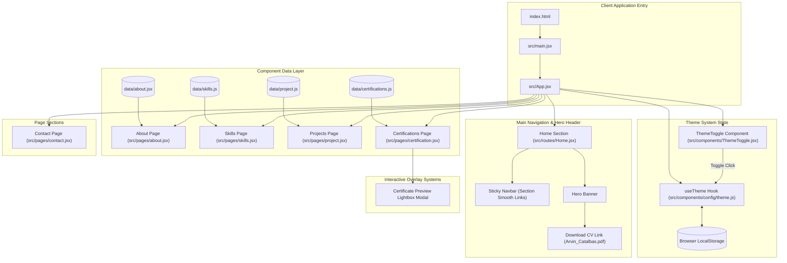

# 🌐 Personal Portfolio Web Application - Arvin Catalbas

A modern, responsive, and high-performance personal portfolio web application built with **React 19**, **Vite**, and **CSS3**. Designed specifically for showcasing Information Technology projects, certifications, technical skill sets, and professional experience with a slick dark/light theme switcher and interactive components.

---

## 🚀 Key Features

- **⚡ Lightning-Fast Build & Bundling**: Powered by Vite and React 19 for instantaneous Hot Module Replacement (HMR) and optimal production performance.
- **🌓 Dynamic Light & Dark Mode**: Persistent theme toggling (`useTheme` custom hook) with automatic system preference detection (`prefers-color-scheme`) and `localStorage` state persistence.
- **📱 Fully Responsive Layout**: Mobile-first grid and flexbox layout adapted for seamless viewing on desktops, tablets, and smartphones.
- **🖼️ Interactive Certification Viewer**: Lightbox modal view for certificate previews with full-screen dynamic scaling.
- **📄 Instant CV/Resume Download**: Direct download trigger for resume assets directly integrated into the hero section.
- **🧩 Modular & Data-Driven Architecture**: Clear separation of concerns between data arrays (`src/data/`), reusable layout components (`src/components/`), section pages (`src/pages/`), and routes (`src/routes/`).

---

## 📐 System Architecture Diagram

The system architecture follows a unidirectional data flow and modular component hierarchy:



---

## 📂 Project Folder Structure

```
my-portfolio-web-app/
├── public/                         # Public static resources
│   ├── favicon.svg                 # Application browser icon
│   └── icons.svg                   # Vector icon asset library
├── src/                            # Core application source code
│   ├── assets/                     # Static media & document assets
│   │   ├── certifications/         # Certification diploma images (JPG/PNG)
│   │   │   ├── Claude_101.jpg
│   │   │   ├── Claude_Code_101.jpg
│   │   │   ├── Claude_Code_in_Action.jpg
│   │   │   ├── Claude_Platform_101.jpg
│   │   │   ├── Diploma.jpg
│   │   │   ├── Getting_Start.png
│   │   │   ├── Javascript_issentials_1.jpg
│   │   │   ├── Network_Basics.jpg
│   │   │   ├── OJT.jpg
│   │   │   └── OS_Basics.jpg
│   │   ├── resume/                 # PDF resume storage
│   │   │   └── Arvin_Catalbas.pdf
│   │   ├── Arvin.png               # Profile hero headshot
│   │   ├── Arvin09.jpg             # Profile image variant
│   │   ├── hero.png                # Hero section background graphic
│   │   ├── react.svg               # React logo asset
│   │   └── vite.svg                # Vite logo asset
│   ├── components/                 # Shared & reusable components
│   │   ├── config/
│   │   │   └── theme.js            # Custom useTheme hook for theme state & storage persistence
│   │   └── ThemeToggle.jsx         # Sun/Moon theme switcher button component
│   ├── data/                       # Content data modules
│   │   ├── about.jsx               # Bio stats & core focus area pillars data
│   │   ├── certifications.js       # Certification list metadata & asset mappings
│   │   ├── project.js              # Featured projects metadata & technology tags
│   │   └── skills.js               # Technical skill set list
│   ├── pages/                      # Main section components
│   │   ├── about.jsx               # "About Me" section component
│   │   ├── certification.jsx       # "Certifications" grid section & modal logic
│   │   ├── contact.jsx             # "Contact Me" section & footer component
│   │   ├── project.jsx             # "Featured Projects" grid component
│   │   └── skills.jsx              # "Skills & Expertise" grid component
│   ├── routes/                     # Top-level view routes & headers
│   │   └── Home.jsx                # Navigation bar & Hero section component
│   ├── App.css                     # Main style sheet (Variables, theme rules, components)
│   ├── App.jsx                     # Root application component orchestrating all sections
│   ├── index.css                   # Global CSS reset & base typography setup
│   └── main.jsx                    # React 19 client root DOM entry point
├── .gitignore                      # Git version control ignore rules
├── .hintrc                         # Webhint linter configuration
├── .oxlintrc.json                  # Oxlint configuration
├── index.html                      # HTML5 root template document
├── package.json                    # Dependencies, scripts, and package metadata
└── vite.config.js                  # Vite bundler build settings
```

---

## 🛠️ Technology Stack

| Category | Technology | Usage |
| :--- | :--- | :--- |
| **Frontend Library** | React 19 (`^19.2.8`) | Core UI library & component-driven view layer |
| **DOM Renderer** | React DOM (`^19.2.8`) | React entry rendering to HTML root container |
| **Build Tool & Server** | Vite 8 (`^8.2.2`) | Development server with instant HMR & production bundler |
| **Plugin Architecture** | `@vitejs/plugin-react` | Official Fast Refresh React plugin for Vite |
| **Code Quality / Linter** | Oxlint (`^1.79.0`) | High-speed JavaScript & JSX code linter |
| **Styling** | Modern CSS3 | Custom CSS variables, responsive Grid/Flex layouts |
| **Icons & Media** | SVG & Optimized Raster | Scalable vector graphics and image assets |

---

## 💻 Getting Started & Installation

### Prerequisites

Ensure you have **Node.js** (v18+ recommended) and **npm** installed on your system.

```bash
node -v
npm -v
```

### 1. Clone the Repository & Navigate to Project Directory

```bash
git clone <repository-url>
cd my-portfolio-web-app
```

### 2. Install Dependencies

```bash
npm install
```

### 3. Run Development Server

Start the local development server with Vite:

```bash
npm run dev
```

Open your browser and navigate to `http://localhost:5173`.

### 4. Build for Production

Generate optimized static assets for deployment:

```bash
npm run build
```

The production output will be generated inside the `dist/` directory.

### 5. Preview Production Build

Locally preview the generated production build:

```bash
npm run preview
```

### 6. Run Code Linter

Execute Oxlint to check code quality and syntax compliance:

```bash
npm run lint
```

---

## 📜 Page Sections Overview

1. **Home / Hero (`src/routes/Home.jsx`)**: Sticky navigation header with smooth scroll links, personal intro headline, call-to-action buttons ("View Projects", "Contact Me"), CV download button, and profile headshot.
2. **About Me (`src/pages/about.jsx`)**: Bio card, career goals, key statistics, and four focus area pillars: Network Engineering, Software & Web Dev, IT Support & Systems, and Goal & Vision.
3. **Skills (`src/pages/skills.jsx`)**: Grid showcasing technical proficiencies including JavaScript, React, TypeScript, PHP, Node.js, HTML5 & CSS3, Figma, Networking, and System Troubleshooting.
4. **Projects (`src/pages/project.jsx`)**: Card layout presenting featured applications such as Portfolio Web Application, Animal Vaccination Management & Information System, Music App, and Notepad App with technology tags.
5. **Certifications (`src/pages/certification.jsx`)**: Achievement showcase displaying industry certificates (Anthropic Claude, Cisco Networking Academy, Degree Diploma, OJT Completion) with click-to-enlarge modal dialog.
6. **Contact & Footer (`src/pages/contact.jsx`)**: Direct email link (`mailto:`), social media connections (GitHub, LinkedIn, Facebook), and copyright footer.

---

## 📄 License

This project is open-source and available under the standard MIT license.
